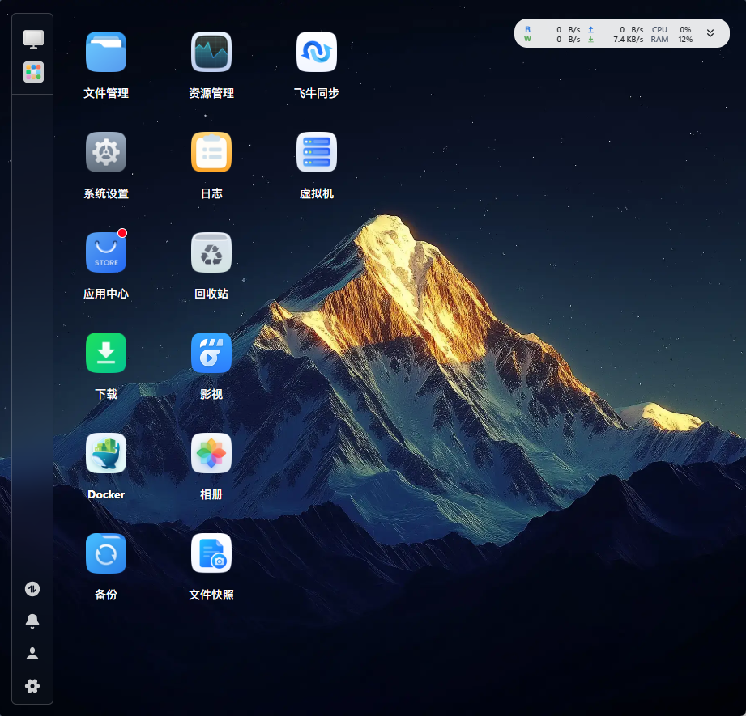
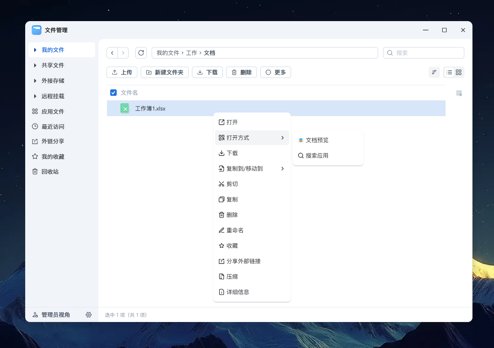
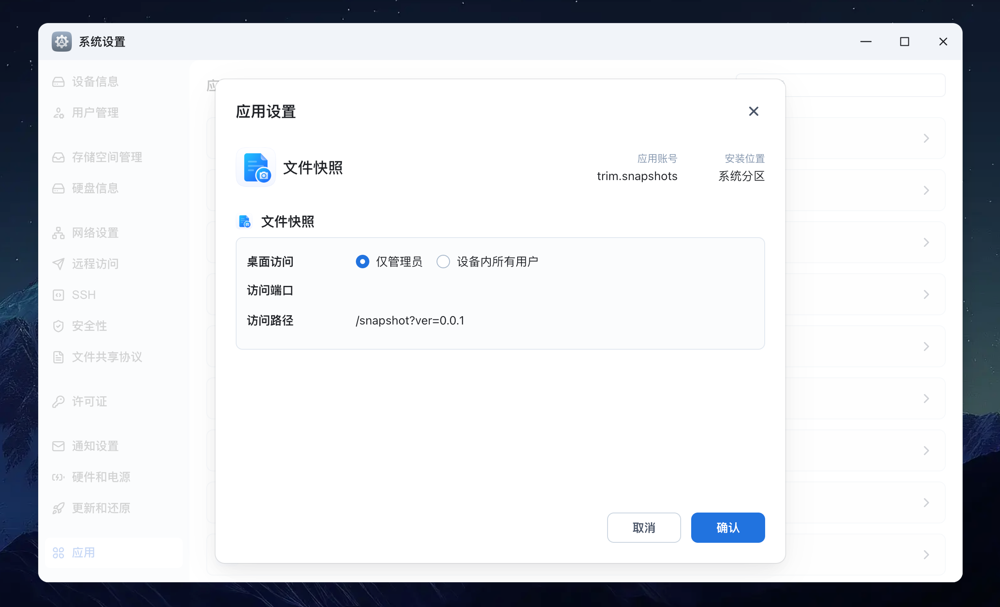

# 📚 【基础】应用入口

> Source: [https://developer.fnnas.com/docs/core-concepts/app-entry/](https://developer.fnnas.com/docs/core-concepts/app-entry/)

> [!NOTE]
> 　　本文档于 **2025-12-31** 重新调整了å†
> 容结构，并新增了部分å†
> 容。

　　应用入口就像是应用的"大门"ï¼Œç”¨æˆ·é€šè¿‡è¿™äº›å…¥å£æ¥è®¿é—®æ‚¨çš„åº”ç”¨ã€‚ä¸€ä¸ªåº”ç”¨å¯ä»¥å®šä¹‰å¤šä¸ªå…¥å£ï¼Œæ¯ä¸ªå…¥å£éƒ½æœ‰ä¸åŒçš„åŠŸèƒ½ã€å›¾æ ‡å’Œè®¿é—®æ–¹å¼ï¼Œè®©ç”¨æˆ·èƒ½å¤Ÿæ–¹ä¾¿åœ°ä½¿ç”¨åº”ç”¨çš„å„ç§åŠŸèƒ½ã€‚

## 入口类型

　　飞牛 fnOS 支持两种主要的应用入口类型：

### æ¡Œé¢å›¾æ ‡å…¥å£

ã€€ã€€æ¡Œé¢å›¾æ ‡å…¥å£è®©ç”¨æˆ·èƒ½å¤Ÿé€šè¿‡ç‚¹å‡»å›¾æ ‡ç›´æŽ¥è®¿é—®æ‚¨çš„åº”ç”¨ã€‚æ‚¨å¯ä»¥ä¸ºåº”ç”¨é…ç½®å¤šä¸ªæ¡Œé¢å›¾æ ‡å…¥å£ï¼Œæ¯ä¸ªå…¥å£å¯¹åº”ä¸åŒçš„åŠŸèƒ½æ¨¡å—ã€‚

> [!NOTE]
> - åœ¨åº”ç”¨ä¸­å¿ƒå’Œåº”ç”¨è®¾ç½®ä¸­æ˜¾ç¤ºä¸ºå¯ç‚¹å‡»çš„å›¾æ ‡
> - 点击后直接打开应用的 Web 界面
> - å¯ä»¥è®¾ç½®ä¸åŒçš„å›¾æ ‡ã€æ ‡é¢˜å’Œè®¿é—®æƒé™



### 文件右键入口

　　文件右键入口允许用户右键点击文件时使用您的应用来打开或编辑文件。

> [!NOTE]
> - 在文件管理器中右键文件时显示
> - å
> è®¸ç”¨æˆ·ä½¿ç”¨æ‚¨çš„应用来查看或编辑特定类型的文件
> - æ”¯æŒå¤šç§æ–‡ä»¶æ ¼å¼
> - 打开文件时会在 URL 后自动拼接 path 参数，åŒ
> 含文件的完整路径



## 入口配置文件 Update!

　　应用入口通过 `config` 文件定义，该文件需要放在 UI 目录下。假设您的 `manifest` 中 `desktop_uidir` 设置为 `ui`，那么配置文件路径就是 `app/ui/config`。

### 项目结构示例

```text
myapp/
├── app/
│   └── ui/
│       ├── images/
│       │   ├── icon-64.png   # 64x64 像素的图标
│       │   └── icon-256.png  # 256x256 像素的图标
│       └── config            # 入口配置文件
├── manifest
├── cmd/
├── config/
├── wizard/
├── LICENSE
├── ICON.PNG
└── ICON_256.PNG
```

### æ¡Œé¢å›¾æ ‡é…ç½®ç¤ºä¾‹

　　入口定义在 `.url` key值下，并必须使用 `appname` 为前缀，如下所示：

**app/ui/config**

```json
{
    ".url": {
        "myapp.main": {
            "title": "我的应用",                   // 应用入口显示标题（桌面图标名称）
            "icon": "images/icon-{0}.png",        // 图标文件路径，相对于 UI 目录
            "type": "url",                        // 入口方式：url/iframe
            "protocol": "http",                   // 访问协议：http/https
            "port": "8080",                       // 应用端口，CGI方案无需声明
            "url": "/",                           // 应用访问路径（相对路径）
            "allUsers": true                      // 是否所有用户可见
        },
        "myapp.admin": {
            "title": "管理后台",                   // 应用入口显示标题（桌面图标名称）
            "icon": "images/admin-icon-{0}.png",  // 图标文件路径，相对于 UI 目录
            "type": "url",                        // 入口方式：url/iframe
            "protocol": "http",                   // 访问协议：http/https
            "port": "8080",                       // 应用端口，CGI方案无需声明
            "url": "/admin",                      // 应用访问路径（相对路径）
            "allUsers": false                     // 是否所有用户可见
        }
    }
}
```

### 文件右键配置示例

**app/ui/config**

```json
{
    ".url": {
        "myapp.editor": {
            "title": "文本编辑器",                        // 应用入口显示标题（右键菜单名称）
            "icon": "images/editor-{0}.png",            // 图标文件路径，相对于 UI 目录
            "type": "url",                              // 入口方式：url/iframe
            "protocol": "http",                         // 访问协议：http/https
            "port": "8080",                             // 应用端口，CGI方案无需声明
            "url": "/edit",                             // 应用访问路径（相对路径）
            "allUsers": true,                           // 是否所有用户可见
            "fileTypes": ["txt", "md", "json", "xml"],  // 文件右键入口关联文件类型
            "noDisplay": true                           // 是否在桌面隐藏
        },
        "myapp.viewer": {
            "title": "文件查看器",                        // 应用入口显示标题（右键菜单名称）
            "icon": "images/viewer-{0}.png",            // 图标文件路径，相对于 UI 目录
            "type": "iframe",                           // 入口方式：url/iframe
            "protocol": "http",                         // 访问协议：http/https
            "port": "8080",                             // 应用端口，CGI方案无需声明
            "url": "/view",                             // 应用访问路径（相对路径）
            "allUsers": true,                           // 是否所有用户可见
            "fileTypes": ["pdf", "doc", "docx"],        // 文件右键入口关联文件类型
            "noDisplay": true                           // 是否在桌面隐藏
        }
    }
}
```

### 基础字段说明

> [!NOTE]
> 　　å
> è®¸ä½¿ç”¨ `${variable_name}` 语法动态获取向导中é
> ç½®å‚数。系统要求：**V1.1.8+**

- `title` - å…¥å£çš„æ˜¾ç¤ºæ ‡é¢˜ï¼Œç”¨æˆ·çœ‹åˆ°çš„åç§°
- `icon` - å›¾æ ‡æ–‡ä»¶è·¯å¾„ï¼Œç›¸å¯¹äºŽ UI 目录
    - {0} ä¼šè¢«æ›¿æ¢ä¸ºå›¾æ ‡å°ºå¯¸ï¼ˆ64 或 256）
    - 例如：images/icon-{0}.png → images/icon-64.png 或 images/icon-256.png
- `type` - 入口类型
    - url - åœ¨æµè§ˆå™¨æ–°æ ‡ç­¾é¡µä¸­æ‰“å¼€
    - iframe - 在桌面窗口中以 iframe æ–¹å¼åŠ è½½
- `protocol` - 访问协议Update!
    - 通常为 http 或 https
    - 为空字符串时为自适应协议（⚠️注：不声明 `protocol` 字段默认缺省值为 http，而非自适应）
    - 范例：protocol: "http" 、 protocol: "https" 、 protocol: ""
- `port` - 应用监听的端口号Update!
    - 如果应用使用 CGI 方案，则不需要声明端口号
    - 如果需要使用动态端口é
  ç½®ï¼Œè¯·ä½¿ç”¨çŽ¯å¢ƒå˜é‡å 位符声明，例如：${wizard_port}V1.1.8+
- `url` - 访问路径，应用内部的相对路径Update!
    - 如果需要使用动态路径é
  ç½®ï¼Œè¯·ä½¿ç”¨çŽ¯å¢ƒå˜é‡å 位符声明，例如：${wizard_url}V1.1.8+
- `allUsers` - 访问权限控制
    - true - 所有用户都可以访问
    - false - ä»
  管理员可以访问

### 文件相关字段说明

- `fileTypes` - 文件右键入口关联文件类型
    - 可以åŒ
  含多个文件扩展名
    - 例如：["txt", "md", "json", "xml"]表示ä»
  支持这些文件类型
- `noDisplay` - 是否在桌面隐藏
    - true - 不在桌面显示，只在右键菜单中显示
    - false - 同时在桌面和右键菜单中显示

### 文件路径参数

　　当用户通过右键菜单打开文件时，系统会自动在 URL åŽæ·»åŠ `path` 参数，包含文件的完整路径。例如：

- 原始 URL：http://localhost:8080/edit
- 打开文件后：http://localhost:8080/edit?path=/vol1/Users/admin/Documents/example.txt

　　您的应用可以通过解析这个 `path` 参数来获取要处理的文件路径。

### 控制字段说明

> [!NOTE]
> 　　**应用中心　》　应用设置　》　控制字段**



- `accessPerm` - 桌面访问的设置权限，默认为 readonly
    - editable - 可编辑
    - readonly - 只读
    - hidden - 隐藏
- **`portPerm`** - 访问端口的设置权限，默认为 `readonly`废弃V1.1.8+
    - `editable` - 可编辑
    - `readonly` - 只读
    - `hidden` - 隐藏
- **`pathPerm`** - 访问路径的设置权限，默认为 `readonly`废弃V1.1.8+
    - `editable` - 可编辑
    - `readonly` - 只读
    - `hidden` - 隐藏

> [!NOTE]
> 您可以通过 `control` å­—æ®µï¼ˆä»£ç å—æ·±è‰²éƒ¨åˆ†ï¼‰æ¥æŽ§åˆ¶å
> ¥å£å¯¹ç”¨æˆ·çš„显示和编辑权限：

**app/ui/config**

```json
{
    ".url": {
        "myapp.advanced": {
            "title": "高级功能",
            "icon": "images/advanced-{0}.png",
            "type": "iframe",
            "protocol": "http",
            "port": "8080",
            "url": "/advanced",
            "allUsers": false,
            "control": {
                "accessPerm": "readonly",
                "portPerm": "readonly",     // V1.1.8版本及以上该字段属性已废弃
                "pathPerm": "readonly"      // V1.1.8版本及以上该字段属性已废弃
            },
            "fileTypes": ["pdf", "doc", "docx"],
            "noDisplay": true
        }
    }
}
```

## 最佳实践

### 入口设计原则

1. 功能明确 - 每个入口对应一个明确的功能
2. 用户友好 - ä½¿ç”¨æ¸…æ™°çš„æ ‡é¢˜å’Œæè¿°
3. 权限合理 - æ ¹æ®åŠŸèƒ½è®¾ç½®é€‚å½“çš„è®¿é—®æƒé™
4. å›¾æ ‡ç»Ÿä¸€ - ä¿æŒå›¾æ ‡é£Žæ ¼çš„ä¸€è‡´æ€§

### 文件类型支持

- 只声明应用真正支持的文件类型
- 考虑文件类型的关联性
- 提供清晰的描述说明

### 打开方式选择

- url 类型：适合需要完整浏览器功能的场景，如复杂的编辑界面
- iframe 类型：适合轻量级的查看和简单操作，提供更好的集成体验

### 权限控制

- 管理功能设置为管理员专用
- 普通功能对所有用户开放
- 使用 control 字段进行精细控制

é€šè¿‡åˆç†é…ç½®åº”ç”¨å…¥å£ï¼Œæ‚¨å¯ä»¥ä¸ºç”¨æˆ·æä¾›ä¾¿æ·çš„è®¿é—®æ–¹å¼ï¼Œè®©åº”ç”¨çš„ä½¿ç”¨ä½“éªŒæ›´åŠ å‹å¥½ã€‚

---

- Previous: [📚 【基础】应用资源](resource.md)
- Next: [📚 【基础】用户向导](wizard.md)
