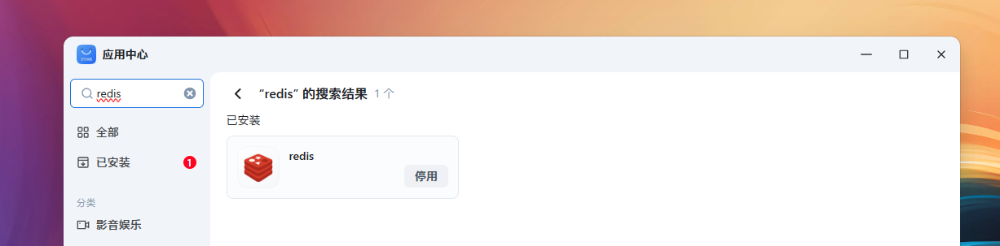
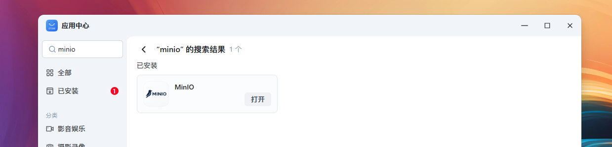
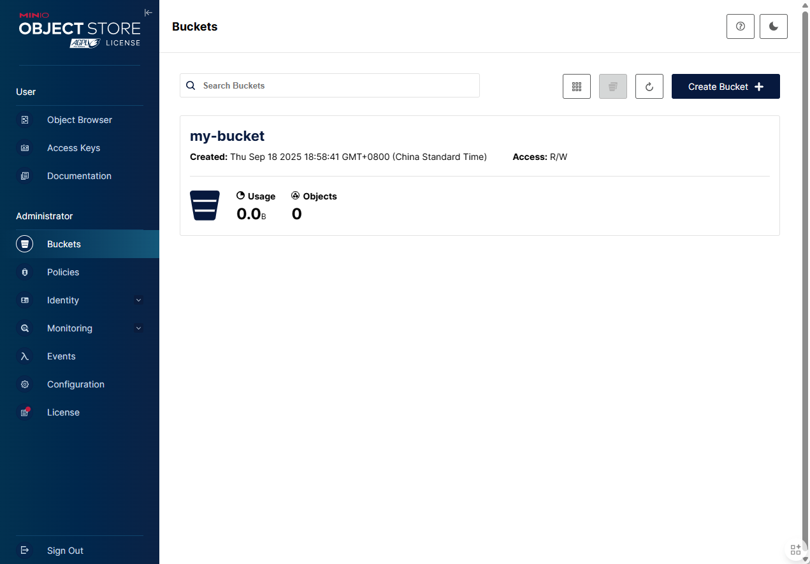
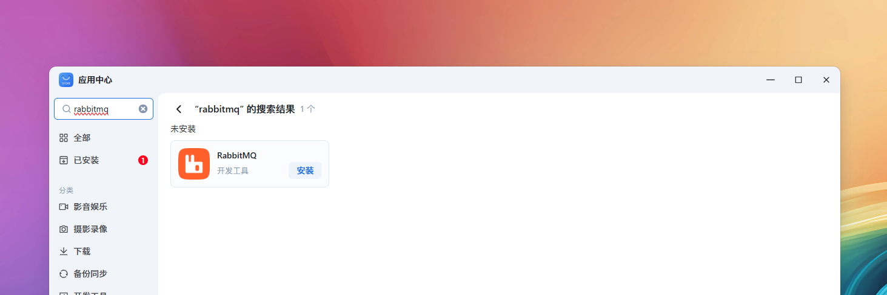

# 🔥 【进阶】中间件服务

> Source: [https://developer.fnnas.com/docs/core-concepts/middleware/](https://developer.fnnas.com/docs/core-concepts/middleware/)

## redis



å¦‚æžœä½ çš„åº”ç”¨éœ€è¦ä¾èµ– redis，请在 `manifest` 的 `install_dep_apps` å­—æ®µä¸­æ·»åŠ redis，应用中心将确保您的应用安装和启动时 redis 服务已在运行。

**manifest**

```yaml
install_dep_apps=redis
```

Python 使用示例

```python
import redis

def main():
    # 创建连接池，指定逻辑数据库（如 db=1），防止冲突
    # 默认配置下的 redis 可通过 host 127.0.0.1 和 port 6739 连接
    pool = redis.ConnectionPool(host='127.0.0.1', port=6379, db=1, decode_responses=True, max_connections=10)

    # 从连接池获取连接
    client = redis.Redis(connection_pool=pool)

    # 使用连接
    client.lpush('my_list', 'item1', 'item2')
    items = client.lrange('my_list', 0, -1)
    print(items)  # 输出: ['item2', 'item1']

    # 不需要手动关闭连接，连接池会管理
    # 但在程序退出前，可以关闭连接æ±
    # pool.disconnect()
    # 如需切换数据库，可重新创建连接池并指定不同的 db 参数

if __name__ == "__main__":
    main()
```

## MinIO



MinIO 是一个高性能、云原生的开源对象存储系统，完全兼容 Amazon S3 API，且支持私有化部署。

å¦‚æžœä½ çš„åº”ç”¨éœ€è¦ä¾èµ–MinIO，请在 `manifest` 的 `install_dep_apps` å­—æ®µä¸­æ·»åŠ minio，应用中心将确保您的应用安装和启动时 MinIO 服务已在运行。

**manifest**

```yaml
install_dep_apps=minio
```

Python 使用示例

```python
import minio
from minio import Minio
from minio.error import S3Error

# 1. 初始化客户端
# 默认配置下的 MinIO 可通过 host 127.0.0.1 和 port 9000 连接
client = Minio(
    endpoint="127.0.0.1:9000",
    access_key="your_access_key",   # 替换为你的 MinIO 管理员用户名 或 Access Key
    secret_key="your_secret_key",   # 替换为你的 MinIO 管理员密码 或 Secret Key
    secure=False                    # 本地测试通常为 False
)

# 2. 定义桶名
bucket_name = "my-bucket"

# 创建 Bucket 示例
def main():
    try:
        # 检查桶是否存在，如果不存在则创建它
        if not client.bucket_exists(bucket_name):
            client.make_bucket(bucket_name)
            print(f"Bucket '{bucket_name}' 已创建.")
        else:
            print(f"Bucket '{bucket_name}' 已存在.")
    except S3Error as err:
        print("创建 Bucket 时发生错误:", err)

if __name__ == "__main__":
    main()
```

打开 MinIO 管理后台，确认 my-bucket 被成功创建：



## RabbitMQ



å¦‚æžœä½ çš„åº”ç”¨éœ€è¦ä¾èµ– RabbitMQ，请在 `manifest` 的 `install_dep_apps` å­—æ®µä¸­æ·»åŠ rabbitmq，应用中心将确保您的应用安装和启动时 RabbitMQ 服务已在运行。

**manifest**

```yaml
install_dep_apps=rabbitmq
```

Python 使用示例

```python
import sys
import time
import uuid
import pika

HOST = "127.0.0.1"
PORT = 5672
VHOST = "/"
USERNAME = "guest"
PASSWORD = "guest"
QUEUE = "ai_rabbitmq_connectivity_test_queue"
TIMEOUT_SECONDS = 8.0

def run_demo() -> int:
    connection = None
    channel = None

    print(f"连接: {HOST}:{PORT} vhost='{VHOST}' 用户='{USERNAME}'")
    try:
        credentials = pika.PlainCredentials(USERNAME, PASSWORD)
        connection = pika.BlockingConnection(pika.ConnectionParameters(
            host=HOST,
            port=PORT,
            virtual_host=VHOST,
            credentials=credentials,
            ssl_options=None,
            connection_attempts=2,
            retry_delay=1.0,
            socket_timeout=max(5.0, TIMEOUT_SECONDS),
            blocked_connection_timeout=max(5.0, TIMEOUT_SECONDS),
            heartbeat=30,
        ))
        channel = connection.channel()

        # 声明测试队列（非持久、自动删除）
        channel.queue_declare(queue=QUEUE, durable=False, auto_delete=True)
        print(f"队列已声明: {QUEUE}")

        # 发送一条测试消息
        correlation_id = str(uuid.uuid4())
        body_text = f"rabbitmq demo - {correlation_id}"
        channel.basic_publish(
            exchange="",
            routing_key=QUEUE,
            body=body_text.encode("utf-8"),
            properties=pika.BasicProperties(
                content_type="text/plain",
                delivery_mode=1,
                correlation_id=correlation_id,
            ),
        )
        print("消息已发送")

        # 简单轮询拉取消息
        deadline = time.monotonic() + TIMEOUT_SECONDS
        while time.monotonic() < deadline:
            method_frame, properties, body = channel.basic_get(queue=QUEUE, auto_ack=True)
            if method_frame:
                got = body.decode("utf-8", errors="replace") if body else ""
                ok = (getattr(properties, "correlation_id", None) == correlation_id) and (got == body_text)
                print("收到:", got)
                print("校验:", "通过" if ok else "不匹配")
                return 0 if ok else 1
            time.sleep(0.2)

        print(f"在 {TIMEOUT_SECONDS}s 内未收到消息", file=sys.stderr)
        return 1
    except Exception as exc:  # pragma: no cover
        print("发生错误:", file=sys.stderr)
        print(str(exc), file=sys.stderr)
        return 1
    finally:
        try:
            if channel and channel.is_open:
                try:
                    channel.queue_delete(queue=QUEUE)
                except Exception:
                    pass
        finally:
            if connection and connection.is_open:
                try:
                    connection.close()
                except Exception:
                    pass

if __name__ == "__main__":
    sys.exit(run_demo())
```

## MariaDB

即将上线...

---

- Previous: [🔥 【进阶】运行时环境](runtime.md)
- Next: [💻 【实战】Docker 应用构建](docker.md)
