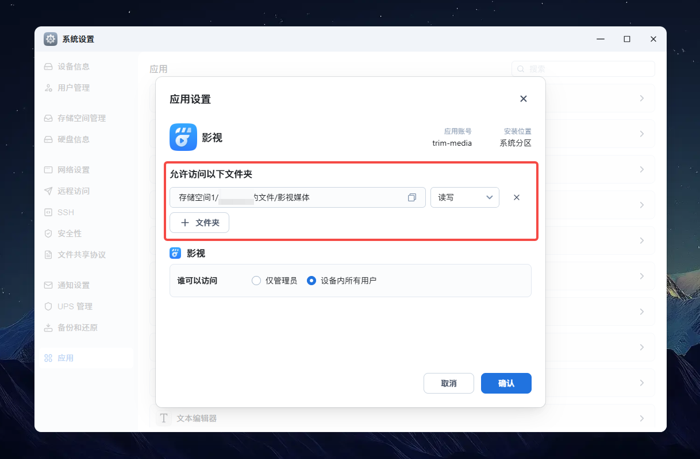

# 📚 【基础】应用权限

> Source: [https://developer.fnnas.com/docs/core-concepts/privilege/](https://developer.fnnas.com/docs/core-concepts/privilege/)

权限就像是应用的"权限清单"，决定了应用在系统中能做什么、不能做什么。在 `config/privilege` 文件中，您可以定义应用运行时的权限级别和用户身份。

## 默认权限模式

大多数应用都使用默认权限模式，这是最安全的运行方式：

### 应用用户运行

应用默认以**应用用户**的身份运行，这意味着：

- 系统会为您的应用创建一个专用的用户和用户组
- 所有应用进程都以这个专用用户身份运行
- 应用文件的所有者也是这个专用用户
- 应用只能访问自己的目录和系统允许的公共资源

### 用户配置

您可以通过以下字段自定义应用用户：

**config/privilege**

```json
{
    "defaults": {
        "run-as": "package"
    },
    "username": "myapp_user",
    "groupname": "myapp_group"
}
```

- username - 应用专用用户名，默认为 manifest 中的 appname
- groupname - 应用专用用户组名，默认为 manifest 中的 appname
- run-as - 运行身份，默认为 package（应用用户）

如果未指定用户名和组名，系统会自动使用应用名称（对应 `manifest` 中的 `appname` 字段）创建用户和用户组。

## Root 权限模式

> [!WARNING]
> Root 权限模式ä»
> 适用于飞牛官方合作的企业开发è€
> ã€‚ç¬¬ä¸‰æ–¹åº”ç”¨é»˜è®¤æ— æ³•åœ¨åº”ç”¨ä¸­å¿ƒå‘å¸ƒéœ€è¦ root 权限的应用。

### 何时需要 Root 权限

某些应用可能需要访问系统级资源或执行特权操作，比如：

- 修改系统配置文件
- 访问硬件设备
- 管理其他用户或服务
- 安装系统级软件åŒ

### 配置方式

将 `run-as` 设置为 `root` 即可获得 root 权限：

**config/privilege**

```json
{
    "defaults": {
        "run-as": "root"
    },
    "username": "myapp_user",
    "groupname": "myapp_group"
}
```

### Root 权限的影响

启用 root 权限后：

- 应用脚本以 root 身份执行
- 应用进程可以以 root 身份或指定的应用用户身份运行
- 应用文件的所有者变为 root 用户
- 系统仍会创建应用专用用户和用户组（用于特定场景）

## 外部文件访问权限

### 默认限制

å‡ºäºŽå®‰å…¨è€ƒè™‘ï¼Œåº”ç”¨é»˜è®¤æ— æ³•è®¿é—®ç”¨æˆ·çš„ä¸ªäººæ–‡ä»¶ã€‚ç”¨æˆ·éœ€è¦åœ¨åº”ç”¨è®¾ç½®ä¸­æ˜Žç¡®æŽˆæƒåŽï¼Œåº”ç”¨ç”¨æˆ·æ‰èƒ½è®¿é—®ç‰¹å®šç›®å½•ã€‚

### 授权方式

方式一：用户可以在**应用设置**页面中：



1. 选择要授权的目录或文件
2. 设置访问权限类型：
    - 读写权限：应用可以读取和修改文件
    - 只读权限：应用只能读取文件，不能修改
    - ç¦æ­¢è®¿é—®ï¼šåº”ç”¨æ— æ³•è®¿é—®è¯¥è·¯å¾„

方式二：通过 `config/resource` 的 `data-share` 设置默认的共享目录

## 权限最佳实践

### 安全原则

1. 默认安全：优先使用应用用户模式，避免不必要的 root 权限
2. 明确授权：通过向导让用户明确了解应用需要的权限

```text
### 权限检查
在应用脚本中，您可以检查当前运行的用户身份：

```bash
#!/bin/bash

echo "当前运行用户: $TRIM_RUN_USERNAME"
echo "应用专用用户: $TRIM_USERNAME"

if [ "$TRIM_RUN_USERNAME" = "root" ]; then
    echo "应用以 root 权限运行"
else
    echo "应用以应用用户权限运行"
fi
```

é€šè¿‡åˆç†çš„æƒé™é…ç½®ï¼Œæ‚¨çš„åº”ç”¨æ—¢èƒ½å¤Ÿæ­£å¸¸è¿è¡Œï¼Œåˆä¸ä¼šå¯¹ç³»ç»Ÿå®‰å…¨é€ æˆå¨èƒã€‚

---

- Previous: [📚 【基础】环境变量](environment-variables.md)
- Next: [📚 【基础】应用资源](resource.md)
