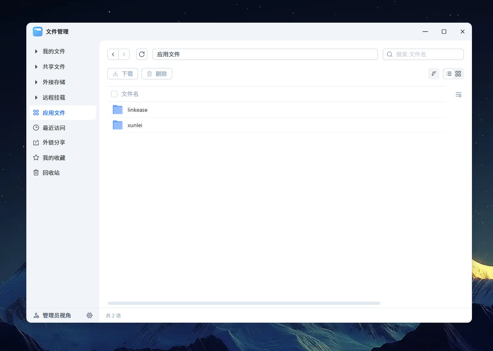

# 📚 【基础】应用资源

> Source: [https://developer.fnnas.com/docs/core-concepts/resource/](https://developer.fnnas.com/docs/core-concepts/resource/)

资源就像是应用的"能力清单"，告诉系统您的应用需要哪些额外的功能和权限。在 `config/resource` 文件中，您可以声明应用需要的扩展能力，比如数据共享、系统集成、容器支持等。

## 数据共享 (data-share)

数据共享功能允许您的应用与用户共享特定的数据目录，让用户可以直接在文件管理器中访问和管理这些数据。



### 功能特点

- 共享目录仅在系统管理员的文件管理 - 应用文件中可见
- 可以设置不同的访问权限：只读、读写
- 支持多级目录结构
- 应用可以实时访问这些共享数据

### 配置示例

**config/resource**

```json
{
    "data-share": {
        "shares": [
            {
                "name": "documents",
                "permission": {
                    "rw": ["myapp_user"]
                }
            },
            {
                "name": "documents/backups",
                "permission": {
                    "ro": ["myapp_user"]
                }
            }
        ]
    }
}
```

### 权限类型说明

- rw - 读写权限：应用可以读取和修改文件
- ro - 只读权限：应用只能读取文件，不能修改

### 使用场景

- 文档管理应用：共享文档目录，让用户直接编辑
- 备份应用：共享备份目录，让用户查看备份文件
- 媒体应用：共享媒体库，让用户管理音乐、视频等

## 系统集成 (usr-local-linker)

系统集成功能允许您的应用在启动时创建软链接到系统目录，让其他应用或系统工具能够直接访问您的应用提供的功能。

### 功能特点

- 应用启动时自动创建软链接
- 应用停止时自动移除软链接
- 支持 bin、lib、etc 三个系统目录
- æ— éœ€æ‰‹åŠ¨ç®¡ç†é“¾æŽ¥çš„åˆ›å»ºå’Œåˆ é™¤

### 配置示例

**config/resource**

```json
{
    "usr-local-linker": {
        "bin": [
            "bin/myapp-cli",
            "bin/myapp-server"
        ],
        "lib": [
            "lib/mylib.so",
            "lib/mylib.a"
        ],
        "etc": [
            "etc/myapp.conf",
            "etc/myapp.d/default.conf"
        ]
    }
}
```

### 链接说明

- bin - 可执行文件链接到 /usr/local/bin/
- lib - 库文件链接到 /usr/local/lib/
- etc - 配置文件链接到 /usr/local/etc/

### 使用场景

- 命令行工具：提供 CLI 工具供其他应用使用
- 开发库：提供共享库供其他应用调用
- é…ç½®æ–‡ä»¶ï¼šæä¾›æ ‡å‡†é…ç½®æ–‡ä»¶ä¾›ç³»ç»Ÿä½¿ç”¨

## Docker 项目支持 (docker-project)

Docker 项目支持让您的应用可以基于 Docker Compose 运行，支持复杂的容器编排和多服务架构。

### 项目结构

首先需要在应用项目中创建 Docker 相关文件：

```text
myapp/
├── app/
│   └── docker/
│       └── docker-compose.yaml
├── manifest
├── cmd/
│   ├── main
│   ├── install_init
│   └── ...
├── config/
│   ├── privilege
│   └── resource
└── ...
```

### Docker Compose 文件示例

**app/docker/docker-compose.yaml**

```yaml
version: '3.8'

services:
  web:
    build: .
    ports:
      - "8080:80"
    volumes:
      - ./data:/app/data
    environment:
      - DB_HOST=db
      - DB_PORT=3306
    depends_on:
      - db

  db:
    image: mysql:8.0
    environment:
      - MYSQL_ROOT_PASSWORD=password
      - MYSQL_DATABASE=myapp
    volumes:
      - db_data:/var/lib/mysql

volumes:
  db_data:
```

### 资源配置

**config/resource**

```json
{
    "docker-project": {
        "projects": [
            {
                "name": "myapp-stack",
                "path": "docker"
            }
        ]
    }
}
```

### 配置说明

- name - Docker Compose é¡¹ç›®çš„åç§°ï¼Œç”¨äºŽæ ‡è¯†å’Œç®¡ç†
- path - 相对于 app 目录的路径，指向包含 docker-compose.yaml 的文件夹

### 使用场景

- 微服务应用：包含多个相互依赖的服务
- 数据库应用：需要数据库、缓存等多个组件
- 复杂应用：需要特定的运行环境和依赖

---

- Previous: [📚 【基础】应用权限](privilege.md)
- Next: [📚 【基础】应用入口](app-entry.md)
