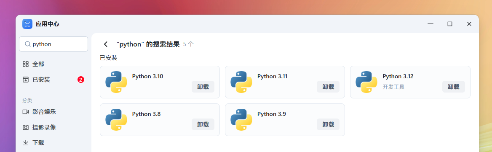
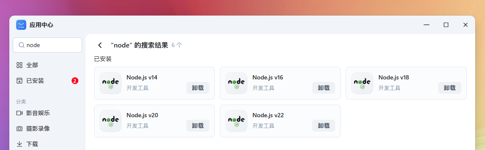
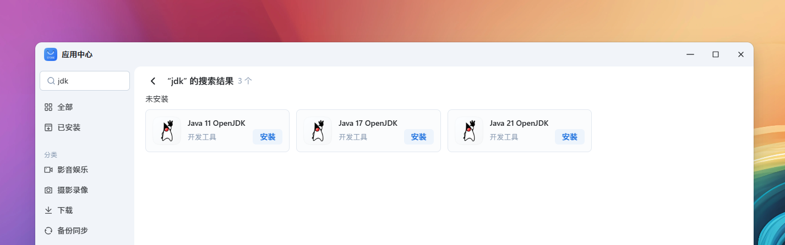

# 🔥 【进阶】运行时环境

> Source: [https://developer.fnnas.com/docs/core-concepts/runtime/](https://developer.fnnas.com/docs/core-concepts/runtime/)

## Python 环境



通过 `manifest` 声明应用依赖指定版本的 Python 应用，应用中心将确保您的应用安装和启动时指定的 Python 环境已安装。

**manifest**

```yaml
install_dep_apps=python312
```

在 `cmd` 相关脚本执行 python å‘½ä»¤å‰ï¼Œéœ€é¢„å…ˆé…ç½®çŽ¯å¢ƒï¼Œå°†ç›®æ ‡ç‰ˆæœ¬çš„ bin 路径置于 PATH 环境变量最前端，以确保当前命令行会话能正确调用指定版本的 python 及 pip 等命令。在此基础上，使用 Python 内置的 venv 模块为每个项目创建独立的虚拟环境，以隔离项目依赖，避免版本冲突。

```shell
# 可选版本：python312、python311、python310、python39、python38
export PATH=/var/apps/python312/target/bin:$PATH

# 创建虚拟环境
python3 -m venv .venv

# 激活虚拟环境
source .venv/bin/activate

# 安装 python 相关依赖到 .venv
pip install -r requirements.txt
```

## Node.js 环境



通过 `manifest` 声明应用依赖指定版本的 Node.js 应用，应用中心将确保您的应用安装和启动时指定的 Node.js 环境已安装。

**manifest**

```yaml
install_dep_apps=nodejs_v22
```

在 `cmd` ç›¸å…³è„šæœ¬æ‰§è¡Œå‰ï¼Œéœ€é¢„å…ˆé…ç½®çŽ¯å¢ƒï¼Œå°†ç›®æ ‡ç‰ˆæœ¬çš„ bin 路径置于 PATH 环境变量最前端，以确保当前命令行会话能正确调用指定版本的 node 及 npm 等命令。

```shell
# 可选版本：nodejs_v22、nodejs_v20、nodejs_v18、nodejs_v16、nodejs_v14
export PATH=/var/apps/nodejs_v22/target/bin:$PATH

# 确认node的版本
node -v

# 确认npm的版本
npm -v
```

## Java 环境



通过 `manifest` 声明应用依赖指定版本的 Java 应用，应用中心将确保您的应用安装和启动时指定的 Java 环境已安装。

**manifest**

```yaml
install_dep_apps=java-21-openjdk
```

在 `cmd` ç›¸å…³è„šæœ¬æ‰§è¡Œå‰ï¼Œéœ€é¢„å…ˆé…ç½®çŽ¯å¢ƒï¼Œå°†ç›®æ ‡ç‰ˆæœ¬çš„ bin 路径置于 PATH 环境变量最前端，以确保当前命令行会话能正确调用指定版本的 java 等命令。

```shell
# 可选版本：java-21-openjdk、java-17-openjdk、java-11-openjdk
export PATH=/var/apps/java-21-openjdk/target/bin:$PATH

# 确认java的版本
java --version
```

---

- Previous: [🔥 【进阶】应用依赖关系](dependency.md)
- Next: [🔥 【进阶】中间件服务](middleware.md)
