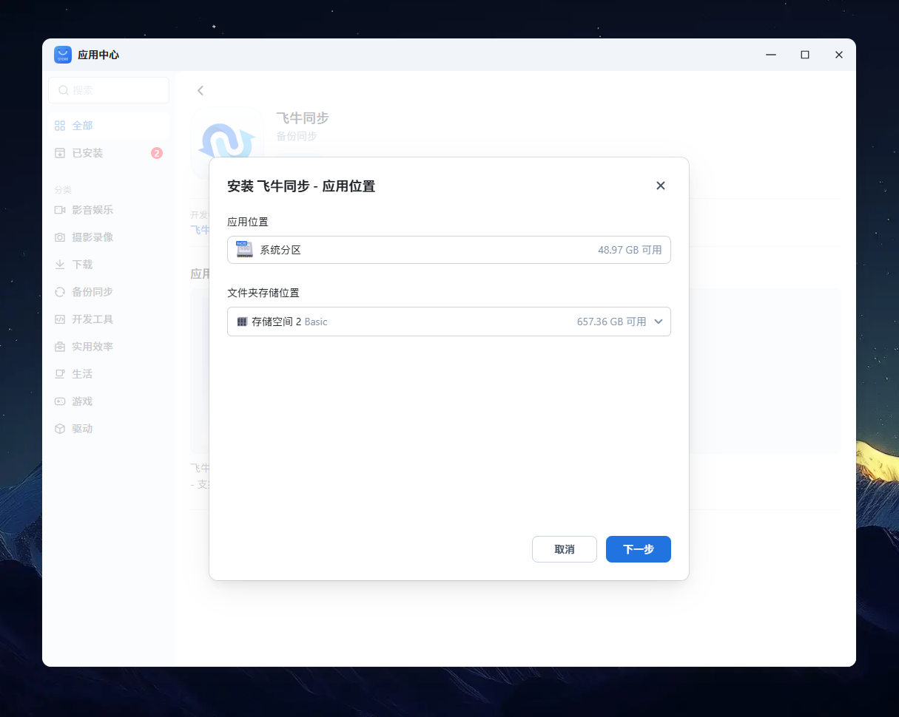

# 📚 【基础】用户向导

> Source: [https://developer.fnnas.com/docs/core-concepts/wizard/](https://developer.fnnas.com/docs/core-concepts/wizard/)

向导就像是应用的"引导员"，帮助用户一步步完成应用的安装、配置和卸载。通过设计友好的向导界面，您可以收集用户的选择和配置，让应用能够更好地满足用户的需求。

## 向导类型

飞牛 fnOS 支持四种类型的向导：

- 安装向导 (wizard/install) - 应用安装时的配置界面
- 卸载向导 (wizard/uninstall) - 应用卸载时的确认界面
- 更新向导 (wizard/upgrade) - 应用更新时的配置界面
- 配置向导 (wizard/config) - 应用设置时的配置界面



## 表单项类型

向导界面由各种表单项组成，每种类型都有特定的用途：

### 文本输入框 (text)

用于收集用户的文本输入，如用户名、邮箱等。

```json
{
    "type": "text",
    "field": "wizard_username",
    "label": "用户名",
    "initValue": "admin",
    "rules": [
        {
            "required": true,
            "message": "请输入用户名"
        },
        {
            "min": 3,
            "max": 20,
            "message": "用户名长度应在3-20个字符之间"
        }
    ]
}
```

### å¯†ç è¾“å…¥æ¡† (password)

ç”¨äºŽæ”¶é›†å¯†ç ç­‰æ•æ„Ÿä¿¡æ¯ï¼Œè¾“å…¥å†…å®¹ä¼šä»¥æ˜Ÿå·æ˜¾ç¤ºã€‚

```json
{
    "type": "password",
    "field": "wizard_password",
    "label": "管理员密码",
    "rules": [
        {
            "required": true,
            "message": "请输入密码"
        },
        {
            "min": 6,
            "message": "密码长度不能少于6位"
        }
    ]
}
```

### 单选按钮 (radio)

用于从多个选项中选择一个，如性别、安装类型等。

```json
{
    "type": "radio",
    "field": "wizard_install_type",
    "label": "安装类型",
    "initValue": "standard",
    "options": [
        {
            "label": "标准安装",
            "value": "standard"
        },
        {
            "label": "自定义安装",
            "value": "custom"
        }
    ],
    "rules": [
        {
            "required": true,
            "message": "请选择安装类型"
        }
    ]
}
```

### 多选框 (checkbox)

用于从多个选项中选择多个，如功能模块、插件等。

```json
{
    "type": "checkbox",
    "field": "wizard_modules",
    "label": "安装模块",
    "initValue": ["web", "api"],
    "options": [
        {
            "label": "Web界面",
            "value": "web"
        },
        {
            "label": "API接口",
            "value": "api"
        },
        {
            "label": "数据库",
            "value": "database"
        }
    ],
    "rules": [
        {
            "required": true,
            "message": "请至少选择一个模块"
        }
    ]
}
```

### 下拉选择框 (select)

用于从下拉列表中选择一个选项，如城市、版本等。

```json
{
    "type": "select",
    "field": "wizard_database_type",
    "label": "数据库类型",
    "initValue": "sqlite",
    "options": [
        {
            "label": "SQLite (推荐)",
            "value": "sqlite"
        },
        {
            "label": "MySQL",
            "value": "mysql"
        },
        {
            "label": "PostgreSQL",
            "value": "postgresql"
        }
    ],
    "rules": [
        {
            "required": true,
            "message": "请选择数据库类型"
        }
    ]
}
```

### 开关 (switch)

用于简单的开启/关闭选择，如是否启用某个功能。

```json
{
    "type": "switch",
    "field": "wizard_enable_backup",
    "label": "启用自动备份",
    "initValue": "true"
}
```

### 提示文本 (tips)

用于显示说明文字、链接或警告信息，不收集用户输入。

```json
{
    "type": "tips",
    "helpText": "请阅读 <a target=\"_blank\" href=\"https://example.com/privacy\">隐私政策</a> 了解我们如何处理您的数据。"
}
```

## 验证规则

验证规则确保用户输入的数据符合要求：

### 必填验证

```json
{
    "required": true,
    "message": "此字段不能为空"
}
```

### 长度限制

```json
{
    "min": 3,
    "max": 50,
    "message": "长度应在3-50个字符之间"
}
```

### 精确长度

```json
{
    "len": 6,
    "message": "请输入6位验证码"
}
```

### 正则表达式验证

```json
{
    "pattern": "^[a-zA-Z0-9_]+$",
    "message": "只能包含字母、数字和下划线"
}
```

## 向导文件结构

每个向导文件都是一个 JSON 数组，包含多个步骤页面：

```json
[
    {
        "stepTitle": "第一步标题",
        "items": [
            // 表单项列表
        ]
    },
    {
        "stepTitle": "第二步标题",
        "items": [
            // 表单项列表
        ]
    }
]
```

## 安装向导示例

下面是一个典型的安装向导，包含隐私协议同意和账号初始化：

**wizard/install**

```json
[
    {
        "stepTitle": "欢迎安装",
        "items": [
            {
                "type": "tips",
                "helpText": "欢迎使用我们的应用！在开始使用前，请阅读并同意我们的服务条款。"
            },
            {
                "type": "tips",
                "helpText": "请阅读 <a target=\"_blank\" href=\"https://example.com/privacy\">隐私政策</a> 和 <a target=\"_blank\" href=\"https://example.com/terms\">服务条款</a>。"
            },
            {
                "type": "switch",
                "field": "wizard_agree_terms",
                "label": "我已阅读并同意服务条款",
                "rules": [
                    {
                        "required": true,
                        "message": "请同意服务条款"
                    }
                ]
            }
        ]
    },
    {
        "stepTitle": "创建管理员账号",
        "items": [
            {
                "type": "text",
                "field": "wizard_admin_username",
                "label": "管理员用户名",
                "initValue": "admin",
                "rules": [
                    {
                        "required": true,
                        "message": "请输入管理员用户名"
                    },
                    {
                        "pattern": "^[a-zA-Z0-9_]+$",
                        "message": "用户名只能包含字母、数字和下划线"
                    }
                ]
            },
            {
                "type": "password",
                "field": "wizard_admin_password",
                "label": "管理员密码",
                "rules": [
                    {
                        "required": true,
                        "message": "请输入管理员密码"
                    },
                    {
                        "min": 8,
                        "message": "密码长度不能少于8位"
                    }
                ]
            },
            {
                "type": "password",
                "field": "wizard_admin_password_confirm",
                "label": "确认密码",
                "rules": [
                    {
                        "required": true,
                        "message": "请确认密码"
                    }
                ]
            }
        ]
    },
    {
        "stepTitle": "应用配置",
        "items": [
            {
                "type": "select",
                "field": "wizard_database_type",
                "label": "数据库类型",
                "initValue": "sqlite",
                "options": [
                    {
                        "label": "SQLite (推荐，无需额外配置)",
                        "value": "sqlite"
                    },
                    {
                        "label": "MySQL",
                        "value": "mysql"
                    }
                ]
            },
            {
                "type": "text",
                "field": "wizard_app_port",
                "label": "应用端口",
                "initValue": "8080",
                "rules": [
                    {
                        "required": true,
                        "message": "请输入端口号"
                    },
                    {
                        "pattern": "^[0-9]+$",
                        "message": "端口号必须是数字"
                    }
                ]
            }
        ]
    }
]
```

## 卸载向导示例

卸载向导通常用于确认用户的选择，特别是关于数据保留的决定：

**wizard/uninstall**

```json
[
    {
        "stepTitle": "确认卸载",
        "items": [
            {
                "type": "tips",
                "helpText": "您即将卸载此应用。请选择如何处理应用数据："
            },
            {
                "type": "radio",
                "field": "wizard_data_action",
                "label": "数据保留选项",
                "initValue": "keep",
                "options": [
                    {
                        "label": "保留数据（推荐）- 将来重新安装时可恢复",
                        "value": "keep"
                    },
                    {
                        "label": "删除所有数据 - 此操作不可恢复！",
                        "value": "delete"
                    }
                ],
                "rules": [
                    {
                        "required": true,
                        "message": "请选择数据保留选项"
                    }
                ]
            },
            {
                "type": "tips",
                "helpText": "<strong>警告：</strong> 选择删除数据后，所有应用数据将永久丢失，无法恢复。"
            }
        ]
    }
]
```

## 获取用户输入

用户在向导中的选择会变成环境变量，您可以在相应的脚本中获取：

### 环境变量命名

- 字段名直接作为环境变量名使用
- 例如：wizard_admin_username 对应环境变量 wizard_admin_username

### 在脚本中使用

```bash
#!/bin/bash

# 获取用户在向导中的选择
ADMIN_USERNAME="$wizard_admin_username"
ADMIN_PASSWORD="$wizard_admin_password"
DATABASE_TYPE="$wizard_database_type"
APP_PORT="$wizard_app_port"

echo "管理员用户名: $ADMIN_USERNAME"
echo "数据库类型: $DATABASE_TYPE"
echo "应用端口: $APP_PORT"

# 根据用户选择执行相应逻辑
if [ "$DATABASE_TYPE" = "mysql" ]; then
    echo "配置MySQL数据库..."
else
    echo "使用SQLite数据库..."
fi
```

## 最佳实践

### 向导设计原则

1. 简洁明了 - 每个步骤只收集必要的信息
2. 用户友好 - ä½¿ç”¨æ¸…æ™°çš„æ ‡ç­¾å’Œå¸®åŠ©æ–‡æœ¬
3. 合理验证 - 及时验证用户输入，避免后续错误
4. 默认值 - 为常用选项提供合理的默认值

### 安全考虑

- å¯†ç å­—æ®µä½¿ç”¨ password 类型
- 敏感信息不要显示在界面上
- 提供隐私政策和服务条款链接

### 用户体验

- 分步骤收集信息，避免一次性要求太多
- 提供清晰的说明和帮助文本
- åœ¨å¸è½½æ—¶æ˜Žç¡®è¯´æ˜Žæ•°æ®åˆ é™¤çš„åŽæžœ

通过精心设计的向导，您可以为用户提供更好的安装和配置体验，同时收集到应用运行所需的配置信息。

---

- Previous: [📚 【基础】应用入口](app-entry.md)
- Next: [🔥 【进阶】应用依赖关系](dependency.md)
