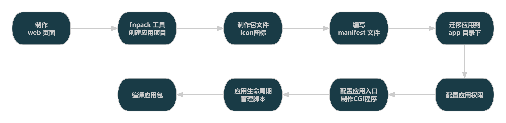

# ✨　创建应用

> Source: [https://developer.fnnas.com/docs/quick-started/create-application/](https://developer.fnnas.com/docs/quick-started/create-application/)

## 从 "0" 开始构建应用中心基础应用

> [!TIP]
> `App.Native.HelloFnosAppCenter` web é¡µé¢ç¤ºä¾‹ä»£ç å¯ä»¥ç‚¹å‡» [此处](https://static.fnnas.com/appcenter-marketing/App.Native.HelloFnosAppCenter.zip) 下载

> [!NOTE]
> è¯¥åº”ç”¨æ•™ç¨‹æ¡ˆä¾‹æ— å®žé™
> 用途ä»
> 为方便开发è€
> 快速了解应用开发及应用封åŒ
> 流程！

## 开发流程

ã€€ã€€ä¸€ä¸ªåº”ç”¨çš„å¼€å‘æµç¨‹ï¼Œå¯ä»¥åˆ†ä¸ºä»¥ä¸‹å‡ ä¸ªæ­¥éª¤ï¼š



## 具体步骤

### 1. 制作 web 页面

　　为方便不同阶段的开发者更快速的了解飞牛 OS 应用中心开发流程，本教程案例将使用前端基础开发语言 `Html/Javascript/CSS` 制作一个简单的 web 页面，包含图片资源、CSS æ ·å¼è¡¨åŠ JS 文件，并将页面保存为 index.html 文件。

#### web 页面目录结构:

```text
HelloFnosAppCenter
├── css
│   └── style.css
├── images
│   └── logo.png
├── index.html
└── js
    └── main.js
```

**./index.html**

```html
<!DOCTYPE html>
<!-- 声明文档类型为 HTML5 -->
<html lang="zh-CN">
<head>
    <!-- 字符编码：确保中文/特殊字符正常显示 -->
    <meta charset="UTF-8">
    <!-- 视口设置：适配移动端 -->
    <meta name="viewport" content="width=device-width, initial-scale=1.0">
    <!-- 页面标题：浏览器标签显示 -->
    <title>应用中心教学演示</title>

    <!-- 引入外部 CSS 样式文件（核心知识点：外部样式引入） -->
    <!-- 路径说明：./ 表示当前目录，css/style.css 是样式文件的相对路径 -->
    <link rel="stylesheet" href="./css/style.css">
</head>
<body>
    <!-- 1. Logo 展示区（核心知识点：图片引入） -->
    <div class="logo-container">
        <!-- src：图片路径；alt：图片加载失败时的替代文本（无障碍/SEO） -->
        
    </div>

    <div class="hello-container">
        <h1 id="helloText">Welcome to the fnOS AppCenter</h1>
        <p class="tips">点击上方文字体验JS交互</p>
    </div>

    <!-- 2. 引入外部 JS 文件（核心知识点：JS 文件引入） -->
    <!-- 建议放在 body 底部：确保 DOM 加载完成后再执行 JS，避免获取不到元素 -->
    <!-- 路径说明：./js/main.js 是JS文件的相对路径 -->
    <script src="./js/main.js"></script>
</body>
</html>
```

**./css/style.css**

```css
/* 全局样式重置 */
* {
    margin: 0;
    padding: 0;
    box-sizing: border-box;
}

/* 页面整体样式 */
body {
    font-family: "Microsoft YaHei", sans-serif; /* 字体设置 */
    background: linear-gradient(120deg, #5f85ff, #48e08f); ; /* 页面蓝绿渐变背景*/
    min-height: 100vh; /* 页面高度占满视口 */
    display: flex; /* Flex布局：让内容垂直+水平居中 */
    flex-direction: column;
    align-items: center;
    justify-content: center;
    gap: 30px; /* 元素之间的间距 */
    /* 渐变背景防重复 */
    background-repeat: no-repeat;
}

/* Logo容器样式 */
.logo-container {
    width: 120px; /* 容器宽度 */
    height: 120px; /* 容器高度 */
    border-radius: 50%; /* 圆形容器 */
    overflow: hidden; /* 裁剪超出容器的图片 */
    border: 3px solid #2563eb; /* 边框样式 */
    box-shadow: 0 0 15px rgba(37, 99, 235, 0.4); /* 阴影效果 */
}

/* Logo图片样式 */
.logo {
    width: 100%; /* 图片宽度占满容器 */
    height: 100%; /* 图片高度占满容器 */
    object-fit: cover; /* 图片等比缩放，填充容器 */
    cursor: pointer; /* 鼠标悬浮显示手型 */
    transition: transform 0.3s ease; /* 过渡动画（教学点：CSS动画） */
}

/* Logo悬浮效果 */
.logo:hover {
    transform: scale(1.2); /* 鼠标悬浮放大1.2倍 */
}

.hello-container {
    text-align: center; /* 文本居中 */
}

#helloText {
    font-size: 48px; /* 字体大小 */
    color: #303133; /* 字体颜色 */
    transition: all 0.3s ease; /* 过渡动画 */
    cursor: pointer;
}

/* 标题悬浮效果 */
#helloText:hover {
    color: #2563eb; /* 悬浮变色 */
    transform: translateY(-5px); /* 悬浮上移 5px */
    /* 新增文字阴影，增强视觉层次 */
    text-shadow: 0 2px 8px rgba(37, 99, 235, 0.3)
}

/* 提示文本样式 */
.tips {
    margin-top: 15px;
    font-size: 16px;
    color: #64748b;
}
```

**./js/main.js**

```js
// 教学点1：DOM 获取元ç´
const helloText = document.getElementById('helloText');

// 教学点2：绑定点击事件（交互核心）
helloText.addEventListener('click', function() {
    // 教学点3：修改 DOM 内容（动态改变文本）
    const originalText = 'Hello fnOS AppCenter !';
    const newText = '👋 你好，飞牛应用中心先锋开发者！';

    if (helloText.innerText === originalText) {
        helloText.innerText = newText;
        // 教学点4：弹出提示框（基础交互）
        alert('🎉 JS交互生效啦！文本已修改～');
    } else {
        helloText.innerText = originalText; // 还原文本
    }
});

// 教学点5：控制台输出（调试常用）
console.log('✅ 外部JS文件加载成功！');
console.log('🔍 当前点击的元素：', helloText);
```

### 2. fnpack 工具创建应用项目

　　使用 `fnpack` 工具创建应用项目，并将 web 页面迁移到 app 目录下。`fnpack` 工具使用方式 [点此了解](../cli/fnpack.md)。

```bash
# 创建独立项目
fnpack create App.Native.HelloFnosAppCenter
```

- 创建完成后将会得到如下目录结构

```text
App.Native.HelloFnosAppCenter
├── app                         # 🗂️ 应用文件目录
│   ├── server                  # 🗂️ 后台服务程序目录（本案例为静态页面不涉及）
│   ├── ui                      # 🗂️ 应用入口及视图
│   │   ├── config              # 🗂️ 应用入口配置文件
│   │   └── images              # 🗂️ 应用图标资源
│   │       ├── icon_256.png    # 应用图标（256x256）
│   │       └── icon_64.png     # 应用图标（64x64）
│   └── www                     # 🗂️ 应用 web 资源目录
├── cmd                         # 🗂️ 应用生命周期管理脚本
│   ├── config_callback         # 应用配置回调脚本
│   ├── config_init             # 应用配置初始化脚本
│   ├── install_callback        # 应用安装回调脚本
│   ├── install_init            # 应用安装初始化脚本
│   ├── main                    # 应用主脚本，用于启动、停止、检查应用状态
│   ├── uninstall_callback      # 应用卸载回调脚本
│   ├── uninstall_init          # 应用卸载初始化脚本
│   ├── upgrade_callback        # 应用更新回调脚本
│   └── upgrade_init            # 应用更新初始化脚本
├── config                      # 🗂️ 应用配置目录
│   ├── privilege               # 应用权限配置
│   └── resource                # 应用资源配置
├── ICON_256.PNG                # 应用包 256*256 图标文件
├── ICON.PNG                    # 应用包 64*64 图标文件
├── manifest                    # 应用包基本信息描述文件
└── wizard                      # 🗂️ 应用向导目录
```

### 3. 制作包文件 icon å›¾æ ‡

- 制作 icon å›¾æ ‡ï¼Œåˆ†åˆ«å¯¼å‡º`256*256`和`64*64`çš„å›¾æ ‡æ–‡ä»¶ï¼Œå¹¶å‘½åä¸º`ICON_256.PNG`和`ICON.PNG`æ”¾ç½®åœ¨é¡¹ç›®æ ¹ç›®å½•ä¸‹ï¼Œå¹¶å°†å¯¹åº”åƒç´ çš„å›¾æ ‡æ–‡ä»¶é¢å¤–å¤åˆ¶ä¸€ä»½æ”¾ç½®åœ¨`app/ui/images`目录下（**æ³¨æ„ï¼šè¯¥è·¯å¾„å›¾æ ‡æ–‡ä»¶çš„å‘½åä¸ºå°å†™ï¼**）
- å›¾æ ‡è®¾è®¡ç´ æï¼Œå¯å‰å¾€ [**iconfont**](https://www.iconfont.cn/) è¿›è¡Œç´ ææœå¯»æŸ¥æ‰¾ï¼Œæ”¯æŒSVG/PNGæ ¼å¼å¯¼å‡ºã€‚

> [!NOTE]
> ã€€å«åœ†è§’çŸ©å½¢èƒŒæ™¯å›¾å±‚å›¾æ ‡ PSD 源文件，可点 [**此处**](https://static.fnnas.com/appcenter-marketing/fnpack_ICON_256.zip) 进行下载。

### 4. 编写 manifest 文件声明应用信息

```text
appname               = App.Native.HelloFnosAppCenter
version               = 1.0.0
display_name          = 教学案例
desc                  = 方便开发者快速了解应用开发及应用封包流程所制作的教学案例
arch                  = x86_64
source                = thirdparty
maintainer            = MR_XIAOBO
distributor           = MR_XIAOBO
desktop_uidir         = ui
desktop_applaunchname = App.Native.HelloFnosAppCenter.Application
```

> [!NOTE]
> 　更多 `manifest应用信息描述文件` é
> ç½®æ–¹æ³•ï¼Œå¯ç‚¹ [**此处**](../core-concepts/manifest.md) è·³è½¬è¿›è¡Œå­¦ä¹ ã€‚

### 5. 迁移 web 应用到 app 目录下

- 复制 web 页面到app/www目录下，复制完的文件结构如下(参照深色部分)：

```text
App.Native.HelloFnosAppCenter
├── app
│   ├── .DS_Store
│   ├── server
│   ├── ui
│   │   ├── config
│   │   ├── .DS_Store
│   │   └── images
│   │       ├── .DS_Store
│   │       ├── icon_256.png
│   │       └── icon_64.png
│   └── www                     # 🗂️ 应用 web 资源目录
│       ├── css                 # 🗂️ 样式文件目录
│       │   └── style.css       # 样式文件
│       ├── images              # 🗂️ 图片文件目录
│       │   └── logo.png        # 图片文件
│       ├── index.html          # index 主页面文件
│       └── js                  # 🗂️ 脚本文件目录
│           └── main.js         # javascript 脚本文件
······ # 其他路径层级略
```

### 6. 配置应用权限

- 使用默认权限模式，以便应用程序以最安全的方式运行（减少高权限对 NAS 系统产生影响）
- 在 config/ 目录下创建 privilege æ–‡ä»¶ï¼ˆæ²¡æœ‰æ–‡ä»¶åŽç¼€ï¼‰ï¼Œå¹¶æ·»åŠ å¦‚ä¸‹å†…å®¹ï¼š

**config/privilege**

```json
{
    "defaults": {
        "run-as": "package"                 // 运行身份，默认为 package（应用用户）
    },
    "username": "hello_fnos_appcenter",     // 应用专用用户名，默认为 manifest 中的 appname
    "groupname": "hello_fnos_appcenter"     // 应用专用用户组名，默认为 manifest 中的 appname
}
```

> [!NOTE]
> 　更多`应用权限`é
> ç½®æ–¹æ³•ï¼Œå¯ç‚¹ [**此处**](../core-concepts/privilege.md) è·³è½¬è¿›è¡Œå­¦ä¹ ã€‚

### 7. 配置应用入口，并制作 CGI 程序

**app/ui/config**

```json
{
    ".url": {
        "App.Native.HelloFnosAppCenter.Application": {
            "title": "应用中心案例",             // 应用入口的显示标题（桌面图标名称）
            "icon": "images/icon-{0}.png",      // 图标文件路径，相对于 UI 目录
            "type": "iframe",                   // 入口类型，桌面窗口模式
            "protocol": "http",                 // 访问协议类型，http
            "url": "/cgi/ThirdParty/App.Native.HelloFnosAppCenter/index.cgi/",
            "allUsers": true                    // 所有用户都可以访问
        }
    }
}
```

#### 字段说明：

- title - å…¥å£çš„æ˜¾ç¤ºæ ‡é¢˜ï¼Œç”¨æˆ·çœ‹åˆ°çš„åç§°
- icon - å›¾æ ‡æ–‡ä»¶è·¯å¾„ï¼Œç›¸å¯¹äºŽ UI 目录
    - {0} ä¼šè¢«ç³»ç»Ÿæ›¿æ¢ä¸ºå›¾æ ‡å°ºå¯¸ï¼ˆ64 或 256）
    - 例如：images/icon-{0}.png → images/icon-64.png 或 images/icon-256.png
- type - 入口类型
    - url - åœ¨æµè§ˆå™¨æ–°æ ‡ç­¾é¡µä¸­æ‰“å¼€
    - iframe - 在桌面窗口中以 iframe æ–¹å¼åŠ è½½
- protocol - 访问协议，通常为 http 或 https
- url - 访问路径，应用内部的相对路径（案例使用 CGI 方案，CGI æœåŠ¡æ˜ å°„è·¯å¾„ï¼š/cgi/ThirdParty/[应用名称]/**.cgi）
- allUsers - 访问权限控制
    - true - 所有用户都可以访问
    - false - ä»
  管理员可以访问

> [!NOTE]
> 　更多`应用å
> ¥å£`é
> ç½®æ–¹æ³•ï¼Œå¯ç‚¹ [**此处**](../core-concepts/app-entry.md) è·³è½¬è¿›è¡Œå­¦ä¹ ã€‚

#### 制作 CGI 程序（推荐）

- 在app/ui目录下创建index.cgi文件（基于 linux 系统 bash 脚本实现），使其可以处理解析 html æ–‡ä»¶å†…å®¹åŠé™æ€èµ„æºè½¬å‘ï¼Œæ·»åŠ å¦‚ä¸‹å†…å®¹ï¼š

**app/ui/index.cgi**

```bash
#!/bin/bash

# 脚本名称: index.cgi
# 　　版本: 1.0.0
# 　　作者: FNOSP/xieguanru
# 　协作者: FNOSP/MR_XIAOBO
# 创建日期: 2025-11-18
# 最后修改: 2025-11-19
# 　　描述: 这个脚本用于演示 Shell 脚本的各种注释方式
# 使用方式: 文件重命名，从 linux_shell_cgi_index.sh 改成 index.cgi,
# 　　　　　放置应用包 /ui 路径下，记得 chmod +x index.cgi 赋权
# 　许可证: MIT

# 【注意】修改你自己的静态文件根目录，以本应用为例：
BASE_PATH="/var/apps/App.Native.HelloFnosAppCenter/target/www"

# 1. 从 REQUEST_URI 里拿到 index.cgi 后面的路径
#    例如：/cgi/ThirdParty/App.Native.HelloFnosAppCenter/index.cgi/index.html?foo=bar
#    先去掉 ? 后面的 query string
URI_NO_QUERY="${REQUEST_URI%%\?*}"

# 默认值（如果没匹配到 index.cgi）
REL_PATH="/"

# 用 index.cgi 作为切割点，取后面的部分
case "$URI_NO_QUERY" in
    *index.cgi*)
        # 去掉前面所有直到 index.cgi 为止的内容，保留后面的
        # /cgi/ThirdParty/App.Native.HelloFnosAppCenter/index.cgi/index.html -> /index.html
        REL_PATH="${URI_NO_QUERY#*index.cgi}"
        ;;
esac

# 如果为空或只有 /，就默认 /index.html
if [ -z "$REL_PATH" ] || [ "$REL_PATH" = "/" ]; then
    REL_PATH="/index.html"
fi

# 拼出真实文件路径：basePath + /ui + index.cgi 后面的路径
TARGET_FILE="${BASE_PATH}${REL_PATH}"

# 简单防御：禁止 .. 越级访问
if echo "$TARGET_FILE" | grep -q '\.\.'; then
    echo "Status: 400 Bad Request"
    echo "Content-Type: text/plain; charset=utf-8"
    echo ""
    echo "Bad Request"
    exit 0
fi

# 2. 判断文件是否存在
if [ ! -f "$TARGET_FILE" ]; then
    echo "Status: 404 Not Found"
    echo "Content-Type: text/plain; charset=utf-8"
    echo ""
    echo "404 Not Found: ${REL_PATH}"
    exit 0
fi

# 3. 根据扩展名简单判断 Content-Type
ext="${TARGET_FILE##*.}"
case "$ext" in
    html|htm)
        mime="text/html; charset=utf-8"
        ;;
    css)
        mime="text/css; charset=utf-8"
        ;;
    js)
        mime="application/javascript; charset=utf-8"
        ;;
    jpg|jpeg)
        mime="image/jpeg"
        ;;
    png)
        mime="image/png"
        ;;
    gif)
        mime="image/gif"
        ;;
    svg)
        mime="image/svg+xml"
        ;;
    txt|log)
        mime="text/plain; charset=utf-8"
        ;;
    *)
        mime="application/octet-stream"
        ;;
esac

# 4. 输出头 + 文件内容
echo "Content-Type: $mime"
echo ""

cat "$TARGET_FILE"
```

> [!NOTE]
> 更多开发语言`CGI 程序`实现案例，请前往社区å
> ±å»ºå›¢å¼€æ”¾å¹³å° **FNOSP** ä»£ç ä»“åº“ä¸­`应用中心通用网å
> ³ CGI 集合`项目获取。
>
> 可点 [**此处**](https://github.com/FNOSP/fnosAppCenterCgiCollection) 跳转进行获取。

#### 替换应用 icon å›¾æ ‡ï¼ˆéžåŒ…æ–‡ä»¶ icon å›¾æ ‡ï¼Œæ­¥éª¤3 如已进行替换请忽略）

- 在app/ui/images目录下创建icon_64.png和icon_256.png文件（注意文件名小写），分别替换默认的应用iconå›¾æ ‡ã€‚
- å›¾æ ‡å°ºå¯¸è¦æ±‚ï¼š
    - icon_64.png - 64x64 像ç´
    - icon_256.png - 256x256 像ç´
- å›¾æ ‡æ ¼å¼è¦æ±‚ï¼šPNG æ ¼å¼
- å›¾æ ‡é€æ˜Žåº¦è¦æ±‚ï¼šä¸é€æ˜Ž
- å›¾æ ‡æ–‡ä»¶åç§°è¦æ±‚ï¼šicon_64.png 和 icon_256.png（注意文件名小写）
- å›¾æ ‡æ–‡ä»¶è·¯å¾„è¦æ±‚ï¼šapp/ui/images 目录下

### 8. 编写应用生命周期管理脚本

　　系统需要准确知道您的应用全部生命周期状态。为此，系统会定期调用 cmd/main è„šæœ¬ï¼ˆé€šè¿‡ä¼ å…¥ä¸é€šå‚æ•°ï¼‰æ¥æ“ä½œ/检查应用状态：

- 脚本返回 exit 0 表示成功或应用运行中
- 脚本返回 exit 1 表示失败或应用已停止
- 脚本返回 exit 3 表示应用未运行

#### å½“å‰æ•™å­¦æ¡ˆä¾‹ä¸ºé™æ€é¡µé¢é¡¹ç›®ï¼Œè„šæœ¬ä¸æ¶‰åŠåŽå°ç¨‹åºè°ƒç”¨ã€å¯åŠ¨åŠè¿è¡ŒçŠ¶æ€åˆ¤æ–­ï¼Œç³»ç»Ÿè°ƒç”¨æ—¶æ— éœ€æ‰§è¡Œå…·ä½“æ“ä½œï¼Œä¿®æ”¹å¦‚ä¸‹ï¼š

**cmd/main**

```bash
#!/bin/bash

case $1 in
start)
    # 启动应用的命令，成功返回 0，失败返回 1
    exit 0
    ;;
stop)
    # 停止应用的命令，成功返回 0，失败返回 1
    exit 0
    ;;
status)
    # 检查应用运行状态，运行中返回 0，未运行返回 3
    exit 0
    ;;
*)
    exit 1
    ;;
esac
```

> [!NOTE]
> 　更多`应用生命周期脚本`é
> ç½®æ–¹æ³•ï¼Œå¯ç‚¹ [**此处**](../core-concepts/framework.md#%E5%BA%94%E7%94%A8%E7%94%9F%E5%91%BD%E5%91%A8%E6%9C%9F%E7%AE%A1%E7%90%86) è·³è½¬è¿›è¡Œå­¦ä¹ ã€‚

### 9. 编译应用包文件

- 使用 fnpack 工具（可点 **此处** 跳转获取）编译应用，生成应用包文件。

```bash
# 前往根目录 App.Native.HelloFnosAppCenter 下执行
fnpack build
```

- 注意：部分用户开发环境电脑未配置系统环境变量，可将 fnpack å·¥å…·æ”¾ç½®æ ¹ç›®å½•ä¸‹ç„¶åŽæ‰§è¡Œï¼š

```bash
# Linux 环境（注意文件版本号）
./fnpack-1.0.4-linux-amd64 build

# MacOS 环境（注意文件版本号）
./fnpack-1.0.4-darwin-amd64 build

# Windows 环境（注意文件版本号）
.\fnpack-1.0.4-windows-amd64 build
```

> [!NOTE]
> 　更多应用开发技能及é
> ç½®æ–¹æ³•ï¼Œå¯ç‚¹å·¦ä¾§ **开发指南** 分类完成【**基础**】部分å†
> å®¹å­¦ä¹ ä»¥ä¾¿äº†è§£æ•´ä¸ªåº”ç”¨ä¸­å¿ƒå¼€å‘è¿‡ç¨‹ã€‚

---

- Previous: [📋　准备工作](prerequisites.md)
- Next: [🧪　测试应用](test-application.md)
