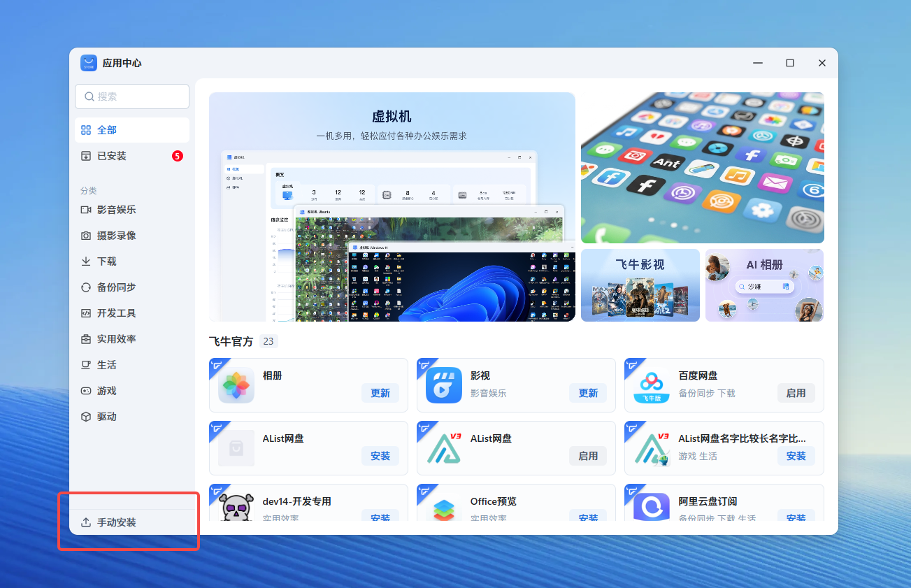

# 🧪　测试应用

> Source: [https://developer.fnnas.com/docs/quick-started/test-application/](https://developer.fnnas.com/docs/quick-started/test-application/)

## 安装 fpk

将 fpk 文件放置到飞牛 fnOS 设备上安装测试：

### 方式一

使用 `appcenter-cli` 工具操作

```bash
appcenter-cli install-fpk App.Native.HelloFnosAppCenter.fpk
```

### 方式二



> [!NOTE]
> 手动安è£
> å
> ¥å£ä»
> 用于应用测试用途，不得用于应用分发。温馨提醒，在系统后续更新中，将补å
>
> ç­¾åæ ¡éªŒé€»è¾‘ã€‚

æ‰‹åŠ¨å®‰è£…å…¥å£é»˜è®¤å…³é—­ï¼Œä½ å¯ä»¥ ssh 登录飞牛 fnOS 后输入以下命令开启

```bash
appcenter-cli manual-install enable
```

## 查看启动停止日志

按照 `cmd/main` 的配置，日志位置为 `/var/apps/App.Native.HelloFnosAppCenter/var/info.log`，可检查是否正常运行

## ç‚¹å‡»æ¡Œé¢å›¾æ ‡

安装并启动完成后，桌面将出现名为 **应用中心案例** çš„å›¾æ ‡ï¼Œç‚¹å‡»å³å¯è®¿é—®åº”ç”¨

---

- Previous: [✨　创建应用](create-application.md)
- Next: [📤　上架应用](publish-application.md)
